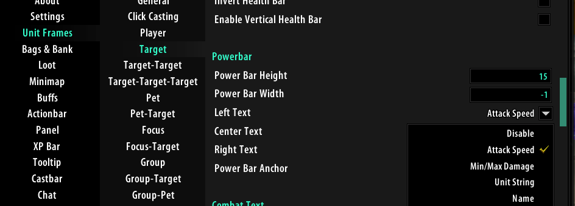

# Turtle-WoW-Macros
A collection of my macros for Turtle WoW

**Buff Macro** - Alt to self cast that works even when targeting a friendly NPC. Will not buff PVP flagged targets.  
```lua
/script s='Power Word: Fortitude' if IsAltKeyDown() then CastSpellByName(s, 1) elseif not UnitIsPVP("target") then CastSpellByName(s) else end
```

**Shows your target's Min & Max damage**  
```lua
/script lowDmg, hiDmg, offlowDmg, offhiDmg, posBuff, negBuff, percentmod = UnitDamage("target") DEFAULT_CHAT_FRAME:AddMessage(format("%s: damage = %.2f - %.2f", GetUnitName("target"), lowDmg, hiDmg))
```

**Shows your target's Attack Speed**  
```lua
/run mainSpeed, offSpeed = UnitAttackSpeed("target") DEFAULT_CHAT_FRAME:AddMessage(format("%s: attack speed = %.2f", GetUnitName("target"), mainSpeed))
```

**Shows your target's Armour and Resistances**   
```lua
/run u=UnitResistance y="target" a=u(y ,0) h=u(y ,1) f=u(y ,2) n=u(y ,3) fr=u(y ,4) s=u(y ,5) z=u(y ,6) DEFAULT_CHAT_FRAME:AddMessage(UnitName(y).." has "..a.." Armor, "..f.." Fire, "..n.." Nature, "..z.." Arcane, "..fr.." Frost and "..s.." Shadow res.")
```

**Spammable Wand Macro** - For this one you have to place the Shoot/Wand ability from your spell book on action slot "12". Which by default is where "=" is bound to.  
Holding shift while using the macro will "orverride" the macro and make the button work like normal. I had a problem where sometimes after being knocked down by an NPC I wasn't able to start wanding again by using the spamable button.  
```lua
/script if(IsShiftKeyDown()) then CastSpellByName('Shoot') elseif not IsAutoRepeatAction(12) then CastSpellByName('Shoot') end
```

---

**SUPER MACROS**

Delete Torch - Scans your inventory for any Dim Torches and deletes them. (Great for those early levels of Survival)  

Macro:  
```lua
/run DeleteTorch(1,1)
```

Extended LUA:  
```lua
function DeleteTorch()
    local bag, slot;
    for bag = 0, 4 do
        for slot = 1, GetContainerNumSlots(bag) do
            local link = GetContainerItemLink(bag, slot);
            if (link and IsTorch(link)) then
                PickupContainerItem(bag, slot);
                DeleteCursorItem();
            end
        end
    end
end

function IsTorch(link)
    local index;
    if (DeleteTorch_ExtractLinkID(link) == 6182) then
        return true;
    end
    return false;
end

function DeleteTorch_ExtractLinkID(link)
    _, _, id = string.find(link, "Hitem:(.+):%d+:%d+:%d+%\124");
    return tonumber(id);
end
```

---

**pfUI Changes**


pfUI\modules\gui.lua around ``line 1024``  
```lua
        "attackspeed:" .. T["Attack Speed"],
        "attackdmg:" .. T["Min/Max Damage"],
```


pfUI\api\unitframes.lua around ``line 2343``  
```lua
-- attack speed/dmg
  elseif config == "attackspeed" then
    local mainSpeed, offSpeed = UnitAttackSpeed("target")
    return unit:GetColor("unit") .. format("Spd: %.2f", mainSpeed) 
  elseif config == "attackdmg" then
    local lowDmg, hiDmg, offlowDmg, offhiDmg, posBuff, negBuff, percentmod = UnitDamage("target")
    return unit:GetColor("unit") .. format("Dmg: %.0f - %.0f", lowDmg, hiDmg)
```


Then when you edit your unti frames in game you should have some new data strings to choose from for your healthbar or powerbar texts. I display mine on my targets manabar/powerbar.


